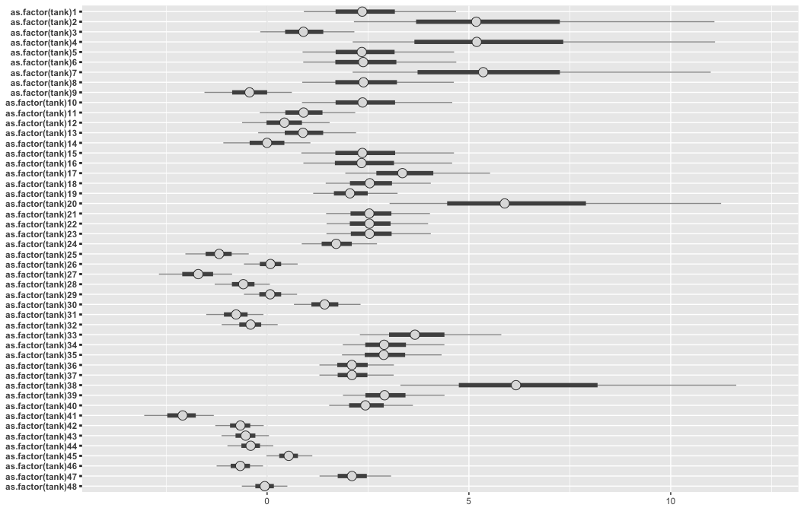
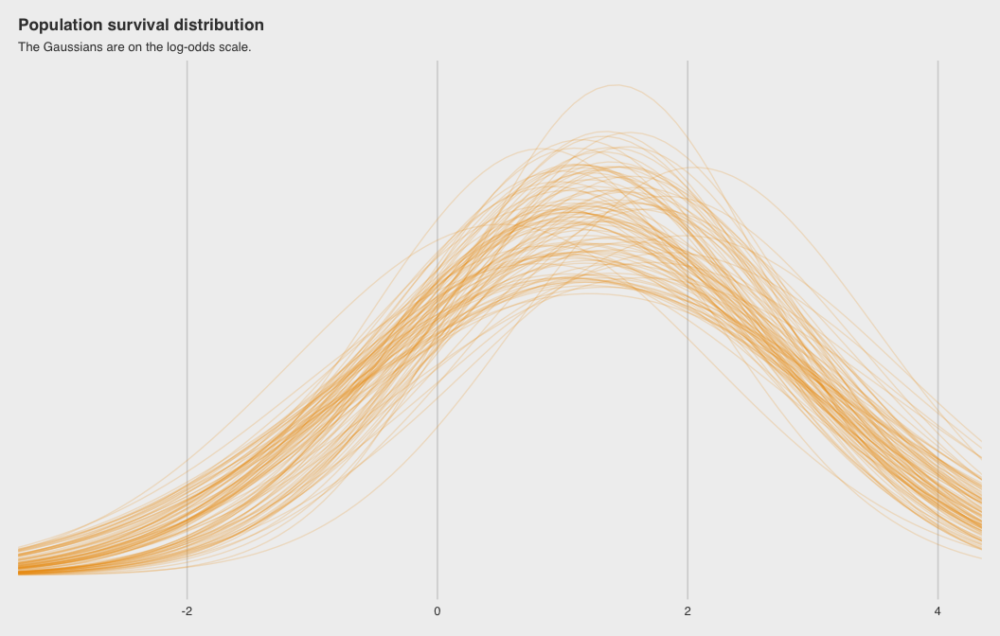

# Overview

- [Stan](https://mc-stan.org) 
  - Probabilistic programming language written in C++
  - Uses the No U-Turn Sampler (NUTS)
- [Stan Interfaces](https://mc-stan.org/users/interfaces/)
  - Exist for R, python, julia, etc.
- Stan with R
  - [rstanarm](http://mc-stan.org/rstanarm/articles/)
  - [brms](https://github.com/paul-buerkner/brms)
  - [rethinking](https://github.com/rmcelreath/rethinking/tree/Experimental)

## Case Study: Multi-level Tadpoles

- Idea blatently stolen from Chapter 12 of (my favorite statistics) book [Stastical Rethinking](https://xcelab.net/rm/statistical-rethinking/) by Richard McElreath
  - See the [online lecture](https://www.youtube.com/watch?v=AALYPv5xSos&t=3140s), which is part of his [Winter 2019 class](https://www.youtube.com/playlist?list=PLDcUM9US4XdNM4Edgs7weiyIguLSToZRI) plus [the slides](https://speakerdeck.com/rmcelreath)
  - More inspiration from McElreath's blog post [Multilevel Regression as Default](http://elevanth.org/blog/2017/08/24/multilevel-regression-as-default/)


### Code Sources

- Code for this case study is drawn primarily from two sources
  - McElreath, Chapter 12 code
    - He sent me his code after I purchased his book (and the pdf!)
    - Can also get draft versions of code [from the draft of the upcoming 2nd edition of his book](http://xcelab.net/rmpubs/sr2/code.txt)
  - Solomon Kurz, Chapter 12 code from his online book [Statistical Rethinking with brms, ggplot2, and the tidyverse](https://bookdown.org/ajkurz/Statistical_Rethinking_recoded/)
    - It goes through McElreath's book doing the models using `brms` and the `tidyverse`
    
    

```r
## install packages
pkgs <- c(
  "coda","mvtnorm","devtools","loo", # for rethinking
  'brms', 'rstanarm', 'rstan', 'tidyverse', 
  'tidybayes', 'ggthemes', 'tictoc', 'ggstance',
  'bayesplot')
invisible(lapply(pkgs, function(x) {
  if(!require(x, character.only = TRUE)) install.packages(x)
}))

## install rethinking experimental branch
library(devtools)
devtools::install_github("rmcelreath/rethinking",ref="Experimental")
```
    
## Example Part 1: Fixed Effects Model

### Fixed vs Random (Pooling) Effects Models Refresher

- A robot visits a cafe and orders coffee in Paris...
  - "Fixed Effects" models analagous to *anmestic* robot
    - Forgets & overfits
  - "Random Effects" models analagous to *nmestic* robot
    - Remembers & regularizes

### Un-pooled Model

Let's get the `reedfrogs` data from rethinking.


```r
## load rstan
library(rstan)
data('reedfrogs', package = 'rethinking')
d <- reedfrogs
rm('reedfrogs')
```

Making the `tank` cluster variable is easy. Keep as integer since `Stan` breaks if grouping variables are not integers.


```r
d %>%
  head(10)
```

```
##    density pred  size surv propsurv
## 1       10   no   big    9      0.9
## 2       10   no   big   10      1.0
## 3       10   no   big    7      0.7
## 4       10   no   big   10      1.0
## 5       10   no small    9      0.9
## 6       10   no small    9      0.9
## 7       10   no small   10      1.0
## 8       10   no small    9      0.9
## 9       10 pred   big    4      0.4
## 10      10 pred   big    9      0.9
```

```r
d <- d %>%
  dplyr::mutate(tank = 1:nrow(d))
```

Here's the formula for the un-pooled model in which each `tank` gets its own intercept ("fixed effects").

\begin{align*}
\text{surv}_i        & \sim \text{Binomial} (n_i, p_i) \\
\text{logit} (p_i)   & = \alpha_{\text{tank}_i} \\
\alpha_{\text{tank}} & \sim \text{Normal} (0, 5)
\end{align*}

And $n_i = \text{density}_i$. Now we'll fit this simple aggregated binomial model (see Chapter 10 of Kunz or McElreath).

Building models with `rethinking` requires being explicit and specific about model parameters, emulating the way it is written out in mathematical notation.


### `rethinking`

`rethinking` models interface with stan by translating the sytnax into Stan code, compiling, then sampling. We'll me using the `ulam` function from the 2nd edition of the book. The 1st edition used `map2stan` which was more user friendly but had a less flexible syntax. 

Stan breaks if you send more data than what is actually used by the model (`declare_all_data = F` option required to work)


```r
tictoc::tic()
set.seed(12)
m12.1 <- rethinking::ulam(
    alist(
        surv ~ binomial( density , p ) ,
        logit(p) <- a_tank[tank] , # a_tank[tank] = "parameter a_tank grouped by [tank]"
        a_tank[tank] ~ normal( 0 , 5 )
    ),
    data = d,
    declare_all_data = FALSE, # only keep data used in model
    iter = 2000, warmup = 500, chains = 4, cores = 4)
tictoc::toc()
```

```
## 39.723 sec elapsed
```

### `brms`

`brms` is similar to `rethinking` in that it translates the model to Stan code and compiles. The formula syntax, however, follows more traditional R formula model syntax, intentionally designed to emulate the formulate syntax of the popular `lme4` package, which also fits Random Effects models but using flat priors and maximum likelihood (not bayes).


```r
tictoc::tic()
b12.1 <- 
  brms::brm(
    surv | trials(density) ~ 0 + factor(tank),
    data = d, family = binomial,
    prior = brms::prior(normal(0, 5), class = b),
    iter = 2000, warmup = 500, chains = 4, cores = 4,
    seed = 12)
tictoc::toc()
```

```
## 41.821 sec elapsed
```

### `rstanarm`

The same model but with `rstanarm`. Starts faster because it runs *pre-complied* Stan code. Has a formula syntax closer to that of `lme4` and `brms` but requires specific functions calls to unlock the pre-compiled magic of the package. For example, if you want to run a simple linear model without random effects, then run `stan_lm`. If you want to run generalized linear models without random effects, then use `stan_glm`. For folks that use R, the suffixes `_lm` and `_glm` will be very familiar.


```r
tictoc::tic()
a12.1 <- 
  rstanarm::stan_glm(
    cbind(surv, density - surv) ~ 0 + as.factor(tank),
    data = d, family = binomial("logit"),
    prior = rstanarm::normal(0,5),
    iter = 2000, warmup = 500, chains = 4, cores = 4,
    seed = 12)
tictoc::toc()
```

```
## 3.833 sec elapsed
```

Compare the model coefficient medians for the fixed effects model.


```r
coef_m <- rethinking::coef(m12.1)
coef_b <- brms::fixef(b12.1)[,1]
coef_a <- coef(a12.1)
coef_mat <- cbind(coef_m, coef_b, coef_a) %>%
  'rownames<-'(sprintf('tank[%d]', 1:nrow(d))) %>%
  'colnames<-'(c('m', 'b', 'a'))
coef_mat
```

```
##                      m              b             a
## tank[1]   2.5279383336  2.49774103267  2.3577099423
## tank[2]   5.7418460838  5.69600186647  5.1810439261
## tank[3]   0.9151654134  0.91876402252  0.8997059529
## tank[4]   5.7436195973  5.72989907198  5.1938257147
## tank[5]   2.5163947670  2.49409442962  2.3455333998
## tank[6]   2.5068233213  2.52310988207  2.3803350233
## tank[7]   5.6829104358  5.72731048968  5.3542459949
## tank[8]   2.5279081858  2.52077155002  2.3876292416
## tank[9]  -0.4307708896 -0.45496038928 -0.4356126228
## tank[10]  2.5120048175  2.50734795521  2.3650990199
## tank[11]  0.9333623570  0.93156514791  0.9039351204
## tank[12]  0.4288236135  0.44000579501  0.4301005974
## tank[13]  0.9176272606  0.92689685036  0.8884245986
## tank[14] -0.0071419376  0.00031940492 -0.0012609937
## tank[15]  2.5103163003  2.53349185853  2.3605923027
## tank[16]  2.5248295530  2.52915251349  2.3394564657
## tank[17]  3.4797111820  3.48583269244  3.3528230653
## tank[18]  2.5940997819  2.62512025339  2.5429584142
## tank[19]  2.1022544080  2.10429831011  2.0534638069
## tank[20]  6.3964811563  6.36851919816  5.8865138915
## tank[21]  2.6157010851  2.61793492017  2.5314236523
## tank[22]  2.6150352659  2.61070375916  2.5344384959
## tank[23]  2.6268295509  2.61523443682  2.5377702811
## tank[24]  1.7329273563  1.74292641493  1.7099431356
## tank[25] -1.2057007347 -1.19582377312 -1.1874387768
## tank[26]  0.0842104707  0.08729522189  0.0835779969
## tank[27] -1.7440567092 -1.73592867373 -1.7069571977
## tank[28] -0.5972061807 -0.59253703475 -0.5897240218
## tank[29]  0.0843675531  0.08673312089  0.0758520808
## tank[30]  1.4466307713  1.45254905507  1.4256110681
## tank[31] -0.7927095751 -0.77867327481 -0.7694869580
## tank[32] -0.4217235935 -0.42300963980 -0.4093781496
## tank[33]  3.8317083268  3.80086533156  3.6627959414
## tank[34]  2.9726508716  2.97066061469  2.8996971635
## tank[35]  2.9583434565  2.97727145398  2.8890364998
## tank[36]  2.1310176933  2.12846572290  2.0982976117
## tank[37]  2.1322857667  2.13845195527  2.1009623351
## tank[38]  6.6793997875  6.64843087462  6.1666916825
## tank[39]  2.9701961549  2.95816107240  2.9093906632
## tank[40]  2.4848070791  2.48288555381  2.4354791720
## tank[41] -2.1422040543 -2.13053194481 -2.0930368066
## tank[42] -0.6598561340 -0.66741801964 -0.6622635022
## tank[43] -0.5394615475 -0.54456101022 -0.5321473348
## tank[44] -0.4133118983 -0.41880814891 -0.4074381125
## tank[45]  0.5338648835  0.53785228404  0.5354522851
## tank[46] -0.6680192604 -0.66984404215 -0.6650005833
## tank[47]  2.1241553438  2.13245216673  2.1015544980
## tank[48] -0.0590177403 -0.05643394363 -0.0586473473
```

### Plotting Posterier Distributions of Coefficients

`rethinking` makes looking at coefficient estimates with varying affects easy. Add `depth=2` because want to model within group.


```r
# rethinking
rethinking::precis(m12.1, depth = 3) %>%
  rethinking::precis_plot()
```

<!-- -->

`brms` is a little tricker but we can use [`tidybayes`](https://mjskay.github.io/tidybayes/articles/tidy-brms.html) to help make a similar coefficient plot.


```r
# look at variable names
b12.1 %>%
  tidybayes::get_variables()
```

```
##  [1] "b_factortank1"  "b_factortank2"  "b_factortank3"  "b_factortank4" 
##  [5] "b_factortank5"  "b_factortank6"  "b_factortank7"  "b_factortank8" 
##  [9] "b_factortank9"  "b_factortank10" "b_factortank11" "b_factortank12"
## [13] "b_factortank13" "b_factortank14" "b_factortank15" "b_factortank16"
## [17] "b_factortank17" "b_factortank18" "b_factortank19" "b_factortank20"
## [21] "b_factortank21" "b_factortank22" "b_factortank23" "b_factortank24"
## [25] "b_factortank25" "b_factortank26" "b_factortank27" "b_factortank28"
## [29] "b_factortank29" "b_factortank30" "b_factortank31" "b_factortank32"
## [33] "b_factortank33" "b_factortank34" "b_factortank35" "b_factortank36"
## [37] "b_factortank37" "b_factortank38" "b_factortank39" "b_factortank40"
## [41] "b_factortank41" "b_factortank42" "b_factortank43" "b_factortank44"
## [45] "b_factortank45" "b_factortank46" "b_factortank47" "b_factortank48"
## [49] "lp__"           "accept_stat__"  "stepsize__"     "treedepth__"   
## [53] "n_leapfrog__"   "divergent__"    "energy__"
```

```r
b12.1 %>%
  tidybayes::gather_draws(`b_factortank.*`, regex = TRUE) %>%
  tidybayes::median_qi() %>%
  ggplot2::ggplot(
    ggplot2::aes(
      y = .variable, 
      x = .value, 
      xmin = .lower, 
      xmax = .upper)) +
  ggstance::geom_pointrangeh(position = ggstance::position_dodgev(height = .3))
```

<!-- -->

Finally, we can use `bayesplot` to plot results of an `rstanarm` object.


```r
# look at variable names
posterior <- a12.1 %>%
  as.array() 

pars <- dimnames(posterior)$parameters 

bayesplot::color_scheme_set("gray")
posterior %>%
  bayesplot::mcmc_intervals(
    pars = pars)
```

<!-- -->


### Multilevel Alternative aka "Pooling" aka "Random Effects"

The formula for the multilevel alternative is

\begin{align*}
\text{surv}_i        & \sim \text{Binomial} (n_i, p_i) \\
\text{logit} (p_i)   & = \alpha_{\text{tank}_i} \\
\alpha_{\text{tank}} & \sim \text{Normal} (\alpha, \sigma) \\
\alpha               & \sim \text{Normal} (0, 1) \\
\sigma               & \sim \text{HalfCauchy} (0, 1)
\end{align*}

`rethinking` random effects models are specified by assigning *hyperparameters* to original prior: `a_tank[tank] ~ normal(0,5)` becomes `a_tank[tank] ~ normal(a, sigma)` where `a` and `sigma` are the parameters for each tank's intercepts. However, these parameters themselves have priors aka *hyperpriors*. This adds a *second* level to the model---hence, it is a *multilevel* model.


```r
tictoc::tic()
set.seed(12)
m12.2 <- 
  rethinking::ulam(
    alist(
        surv ~ binomial( density , p ) ,
        logit(p) <- a_tank[tank] ,
        # a_tank[tank] ~ normal( 0 , 5 ) , (before)
        a_tank[tank] ~ normal( a , sigma ) , 
        a ~ normal(0,1) , # hyperparameter for mean
        sigma ~ cauchy(0,1) # hyperparameter for group dispersion
    ), 
    data=d, declare_all_data = FALSE,
    iter = 4000, warmup = 1000, chains = 4, cores = 4)
tictoc::toc()
```

```
## 34.935 sec elapsed
```

Here is the same model using `brms`.

The syntax for the varying (random) effects follows the [lme4 style](https://cran.r-project.org/web/packages/brms/vignettes/brms_overview.pdf), `( <varying parameter(s)> | <grouping variable(s)> )`. In this case `(1 | tank)` indicates only the intercept, `1`, varies by `tank`. The extent to which parameters vary is controlled by the prior, `prior(cauchy(0, 1), class = sd)`, which is <u>parameterized in the standard deviation metric</u>. Do note that last part. It's common in multilevel software to model in the variance metric, instead. 


```r
tictoc::tic()
b12.2 <- 
  brms::brm(
    surv | trials(density) ~ 1 + (1 | tank),
    data = d, family = binomial,
    prior = c(brms::prior(normal(0, 1), class = Intercept),
              brms::prior(cauchy(0, 1), class = sd)),
    iter = 4000, warmup = 1000, chains = 4, cores = 4,
    seed = 12)
tictoc::toc()
```

```
## 35.742 sec elapsed
```


`rstanarm` will again be very similar. However, note that are now using `stan_glmer` (note the `er` in `glmer`). This specifies that want to use a model with varying (random) effects. These models *require* that a grouping variable be specified i.e `( <varying parameter> | <grouping variable> )`.


```r
tictoc::tic()
a12.2 <- 
  rstanarm::stan_glmer(
    cbind(surv, density - surv) ~ 1 + (1 | tank),
    data = d, family = binomial("logit"),
    prior_intercept = rstanarm::normal(0,1),
    prior = rstanarm::normal(0,1),
    iter = 4000, warmup = 1000, chains = 4, cores = 4,
    seed = 12)
tictoc::toc()
```

```
## 6.473 sec elapsed
```


```r
# extracting the coefficients is a little trickier with brms when using pooled models
coef_m <- rethinking::coef(m12.2)
# brms
coef_b <- c(coef(b12.2)$tank[,1,], brms::fixef(b12.2)[1], sd(brms::ranef(b12.2)$tank[,,1]))
# rstanarm
smry_a <- a12.2$stan_summary
coef_a <- c(coef(a12.2)$tank[,1], rstanarm::fixef(a12.2), smry_a[,'sd'][grepl('_NEW', names(smry_a[,'sd']))])
# woof, merge
coef_mat2 <- cbind(coef_m, coef_b, coef_a) %>%
  'rownames<-'(c(sprintf('tank[%d]', 1:nrow(d)), 'a', 'sigma')) %>%
  'colnames<-'(c('m', 'b', 'a'))
coef_mat2
```

```
##                      m             b             a
## tank[1]   2.1232574871  2.1179248883  2.0766050111
## tank[2]   3.0518538063  3.0506456518  2.9459542719
## tank[3]   0.9926801392  0.9902473075  0.9624812207
## tank[4]   3.0456281868  3.0507013438  2.9550112913
## tank[5]   2.1153952972  2.1205965635  2.0629161508
## tank[6]   2.1346366450  2.1262561542  2.0680621683
## tank[7]   3.0547550205  3.0568624767  2.9473881804
## tank[8]   2.1201282632  2.1282739144  2.0766314787
## tank[9]  -0.1792712587 -0.1856908109 -0.1811606611
## tank[10]  2.1170096279  2.1250090957  2.0629609349
## tank[11]  0.9914240942  0.9935635252  0.9704633234
## tank[12]  0.5734996537  0.5709686635  0.5613971684
## tank[13]  0.9948857927  0.9948499363  0.9683093073
## tank[14]  0.1994217655  0.1878940266  0.2018029427
## tank[15]  2.1306151864  2.1304523056  2.0723467221
## tank[16]  2.1368341432  2.1257254501  2.0595988662
## tank[17]  2.8944522357  2.9000015847  2.8293572939
## tank[18]  2.3882202784  2.3893754821  2.3537694089
## tank[19]  2.0034980197  2.0021628128  1.9745304244
## tank[20]  3.6612304325  3.6597771232  3.5494731747
## tank[21]  2.3898455014  2.3880652198  2.3430093053
## tank[22]  2.3909520451  2.3857416201  2.3444779124
## tank[23]  2.3873857353  2.3772498798  2.3463204305
## tank[24]  1.6998509692  1.6963075182  1.6818668229
## tank[25] -1.0005010124 -1.0090510217 -0.9947647185
## tank[26]  0.1603500731  0.1568512186  0.1586263761
## tank[27] -1.4285701827 -1.4382517265 -1.4138166690
## tank[28] -0.4770679730 -0.4745190424 -0.4722867023
## tank[29]  0.1593673173  0.1593301275  0.1467582922
## tank[30]  1.4410561032  1.4391074286  1.4250983144
## tank[31] -0.6360635684 -0.6411652349 -0.6341017501
## tank[32] -0.3083973541 -0.3122888467 -0.3144191408
## tank[33]  3.1742881596  3.1913875353  3.1110294571
## tank[34]  2.6985581578  2.7049312282  2.6584047520
## tank[35]  2.7012802460  2.7113443588  2.6520516735
## tank[36]  2.0658977032  2.0533977595  2.0276731653
## tank[37]  2.0544972783  2.0550000475  2.0333136913
## tank[38]  3.8799909179  3.8959472837  3.7881685622
## tank[39]  2.7055162518  2.6936471988  2.6616653516
## tank[40]  2.3498664405  2.3456441784  2.3058959917
## tank[41] -1.8111505869 -1.8180192259 -1.7947550803
## tank[42] -0.5815200680 -0.5740221341 -0.5691538767
## tank[43] -0.4512252565 -0.4564427957 -0.4525648339
## tank[44] -0.3402511174 -0.3390219202 -0.3376646426
## tank[45]  0.5776938530  0.5806971756  0.5685582711
## tank[46] -0.5743798160 -0.5752650289 -0.5731511192
## tank[47]  2.0546856021  2.0588911574  2.0276754612
## tank[48]  0.0039331294 -0.0010129768  0.0030743691
## a         1.2986202011  1.2839346906  1.2859972770
## sigma     1.6166030897  1.6514088432  1.6090644500
```


## Plotting: `rethinking` base R vs `brms` with `ggplot2`

### Fig 12.1

Here's base `R` code to reproduce Figure 12.1 of McElreath (2015).

The plot compares estimates of the multilevel model (open circles) with the that of the original empirical proportions (blue circles).

The multilevel model estimates exhibit *shrinkage* (regularization) towards the global proportion of survivors across all tanks.


```r
## R code 12.5
# extract Stan samples
m_post <- rethinking::extract.samples(m12.2)

# compute median intercept for each tank
# also transform to probability with logistic
d$propsurv.est <- rethinking::logistic( apply( m_post$a_tank , 2 , median ) )

# display raw proportions surviving in each tank
plot( d$propsurv , ylim=c(0,1) , pch=16 , xaxt="n" ,
      xlab="tank" , ylab="proportion survival" , col=rethinking::rangi2,
      main    = "Multilevel shrinkage!")
axis( 1 , at=c(1,16,32,48) , labels=c(1,16,32,48) )

# overlay posterior medians
points( d$propsurv.est )

# mark posterior median probability across tanks
abline( h=rethinking::logistic(median(m_post$a)) , lty=2 )

# draw vertical dividers between tank densities
abline( v=16.5 , lwd=0.5 )
abline( v=32.5 , lwd=0.5 )
text( 8 , 0 , "small tanks" )
text( 16+8 , 0 , "medium tanks" )
text( 32+8 , 0 , "large tanks" )
```

<!-- -->

Here is a `brms` version using  `ggplot2` and `ggthemes`.


```r
b_post <- brms::posterior_samples(b12.2, add_chain = T)

post_mdn <- 
  coef(b12.2, robust = T)$tank[, , ] %>% 
  dplyr::as_tibble() %>% 
  dplyr::bind_cols(d) %>%
  dplyr::mutate(post_mdn = brms::inv_logit_scaled(Estimate))

post_mdn %>%
  ggplot2::ggplot(ggplot2::aes(x = tank)) +
  ggplot2::geom_hline(yintercept = brms::inv_logit_scaled(median(b_post$b_Intercept)), linetype = 2, size = 1/4) +
  ggplot2::geom_vline(xintercept = c(16.5, 32.5), size = 1/4) +
  ggplot2::geom_point(ggplot2::aes(y = propsurv), color = "orange2") +
  ggplot2::geom_point(ggplot2::aes(y = post_mdn), shape = 1) +
  ggplot2::coord_cartesian(ylim = c(0, 1)) +
  ggplot2::scale_x_continuous(breaks = c(1, 16, 32, 48)) +
  ggplot2::labs(title    = "Multilevel shrinkage!",
       subtitle = "The empirical proportions are in orange while the model-\nimplied proportions are the black circles. The dashed line is\nthe model-implied average survival proportion.") +
  ggplot2::annotate("text", x = c(8, 16 + 8, 32 + 8), y = 0, 
           label = c("small tanks", "medium tanks", "large tanks")) +
  ggthemes::theme_fivethirtyeight() +
  ggplot2::theme(panel.grid = element_blank())
```

<!-- -->

### Fig 12.2.a


```r
## R code 12.6
# show first 100 populations in the posterior
plot( NULL , xlim=c(-3,4) , ylim=c(0,0.35) ,
    xlab="log-odds survive" , ylab="Density" )
for ( i in 1:100 )
    curve( dnorm(x,m_post$a[i],m_post$sigma[i]) , add=TRUE ,
    col=rethinking::col.alpha("black",0.2) )
```

<!-- -->

`brms` version of Figure 12.2.a


```r
# this makes the output of `sample_n()` reproducible
set.seed(12)
b_post %>% 
  dplyr::sample_n(100) %>% 
  # keep chain and iter to differentiate iterations
  tidyr::expand(tidyr::nesting(iter, chain, b_Intercept, sd_tank__Intercept),
         x = seq(from = -4, to = 5, length.out = 100)) %>% 
  dplyr::mutate(y = dnorm(x, b_Intercept, sd_tank__Intercept)) %>%
  ggplot2::ggplot() +
  ggplot2::geom_line(
    ggplot2::aes(x = x, y = y, group = paste(iter, chain)), # ensure unique iteration
            alpha = .2, color = "orange2") +
  ggplot2::labs(title = "Population survival distribution",
       subtitle = "The Gaussians are on the log-odds scale.") +
  ggplot2::scale_y_continuous(NULL, breaks = NULL) +
  ggplot2::coord_cartesian(xlim = c(-3, 4)) + 
  ggthemes::theme_fivethirtyeight() +
  ggplot2::theme(
    plot.title    = ggplot2::element_text(size = 13),
    plot.subtitle = ggplot2::element_text(size = 10))
```

<!-- -->

Note the uncertainty in terms of both location $\alpha$ and scale $\sigma$. 

### Fig 12.2.b

`rethinking` wrappers over base `R` to plot density curves of survival distribution.


```r
# sample 12000 imaginary tanks from the posterior distribution
sim_tanks <- rnorm( 12000 , m_post$a , m_post$sigma )

# transform to probability and visualize
rethinking::dens( 
  rethinking::logistic(sim_tanks), 
  xlab="probability survive",
  main = "Population survival distribution")
```

<!-- -->

`brms` code


```r
b_post %>%
  ggplot2::ggplot(
    ggplot2::aes(
      x = 
        rnorm(
          n = nrow(b_post), 
          mean = b_Intercept, 
          sd   = sd_tank__Intercept) %>% 
        brms::inv_logit_scaled(.))) +
    ggplot2::geom_density(size = 0, fill = "orange2") +
    ggplot2::scale_y_continuous(NULL, breaks = NULL) +
    ggplot2::ggtitle("Probability of survival") +
    ggthemes::theme_fivethirtyeight()
```

<!-- -->

## Other Bayesian (Stan) Resources

- [Online Python book](https://github.com/pymc-devs/resources/tree/master/Rethinking) for the python folks out there    
- [Rasmus Bååth](http://www.sumsar.net) who has a nice course on [Datacamp](http://www.sumsar.net/blog/2018/12/my-introductory-course-on-bayesian-statistics/)
- [Michael Betancourt](https://betanalpha.github.io) who has great [case studies](https://betanalpha.github.io/writing/) to learn from
- [Stan Reference Manual](https://mc-stan.org/docs/2_19/stan-users-guide/index.html) is amazing


